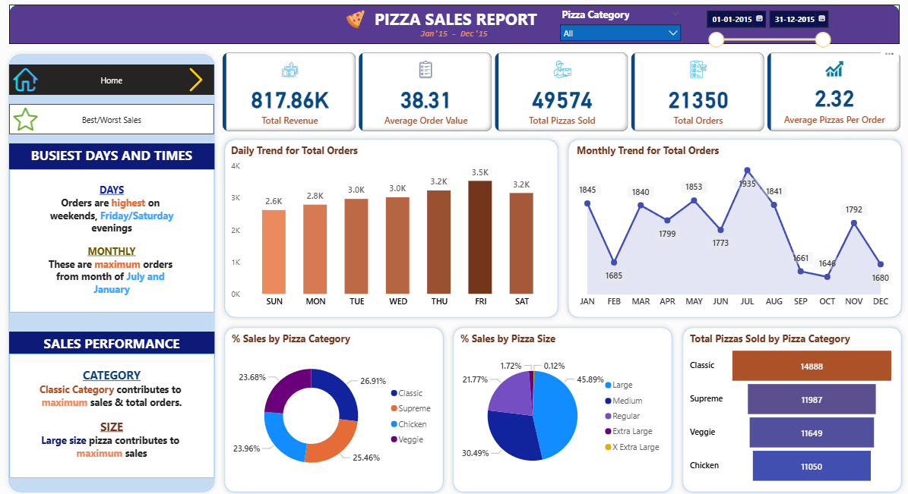
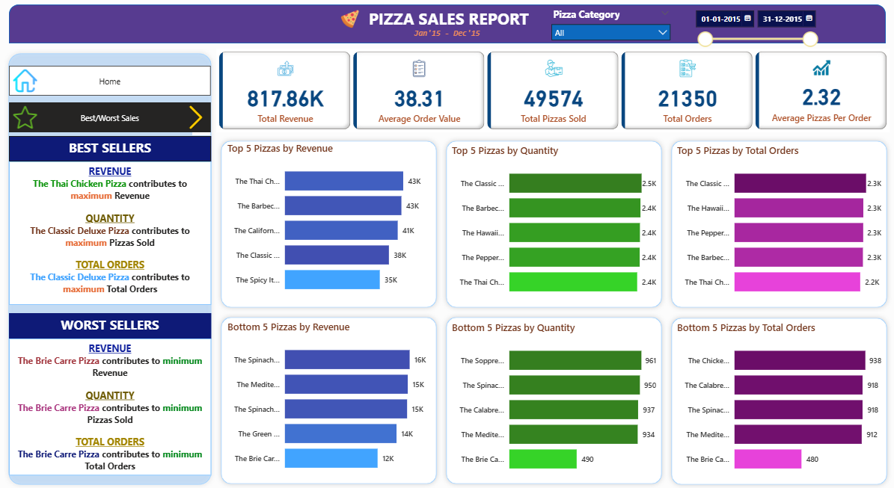

# 🍕 Pizza Sales Analysis Dashboard (Power BI + SQL)

This project presents a **Pizza Sales Analysis Dashboard** built using Microsoft SQL Server and Power BI. It demonstrates an end-to-end data analysis workflow — from importing raw CSV data into SQL Server, running SQL queries for insights, to designing an interactive dashboard in Power BI.

📽️ Based on this tutorial: [Power BI + SQL Dashboard](https://youtu.be/V-s8c6jMRN0?si=GQTTerN-Gt5GBKP6)

---

## 📊 Dashboard Highlights



Key insights:
- 💰 **Total Revenue**: \$817.86K  
- 📦 **Total Orders**: 21,350  
- 🍕 **Total Pizzas Sold**: 49,574  
- 🧾 **Average Order Value**: \$38.31  
- 🍕 **Average Pizzas per Order**: 2.32  

---

## 📈 Insights Extracted

- **Busiest Days**: Friday & Saturday evenings  
- **Top Pizza Category**: Classic  
- **Top Pizza Size**: Large  
- **Best Seller**: Thai Chicken Pizza  
- **Lowest Seller**: Brie Carre Pizza  

---

## 🧠 SQL Analysis

SQL queries were used to compute key performance indicators (KPIs) and insights such as:
- Total revenue, average order value, total orders and pizzas sold
- Daily and monthly trends for order volume
- Category- and size-wise pizza sales percentages
- Top and bottom 5 pizzas by revenue, quantity, and order count

All queries are available in the [`pizza_sales_queries.sql`](pizza_sales_queries.sql) file.

---

## 🖼 Additional View: Best & Worst Sellers



---

## 🧰 Tools Used

- **SQL Server Management Studio (SSMS)** – for data import and querying  
- **Power BI Desktop** – for creating the interactive dashboard  
- **CSV Dataset** – loaded into SQL Server from the tutorial source

---

## 📁 Project Structure

```
Power-BI-SQL-Project/
├── README.md
├── Dashboard.pbix
├── Dashboard.pdf
├── pizza_sales_queries.sql
├── PIZZA SALES QUERIES.pdf
├── screenshots/
│   ├── homepage.png
│   └── best-worst_sellers.png
└── pizza_sales.csv  

```

---

## 🚀 How to Run

1. Import the CSV dataset into your local SQL Server as `pizza_sales` table.
2. Open `pizza_sales_queries.sql` in SSMS to verify or re-run SQL analysis.
3. Open `dashboard.pbix` in Power BI Desktop and refresh the data connection if needed.

---

## 📝 Notes

- This project is for learning and portfolio purposes.
- Data is sourced from a public tutorial.
- Dashboard is fully interactive and allows filtering by date, pizza category, and size.

---

## 👨‍💻 Author

**Sanyam Barwar**  
*Built as part of a self-learning initiative in data analysis using SQL and Power BI.*